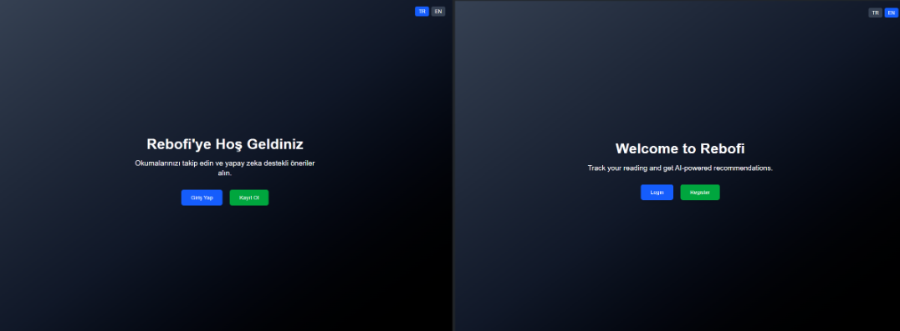
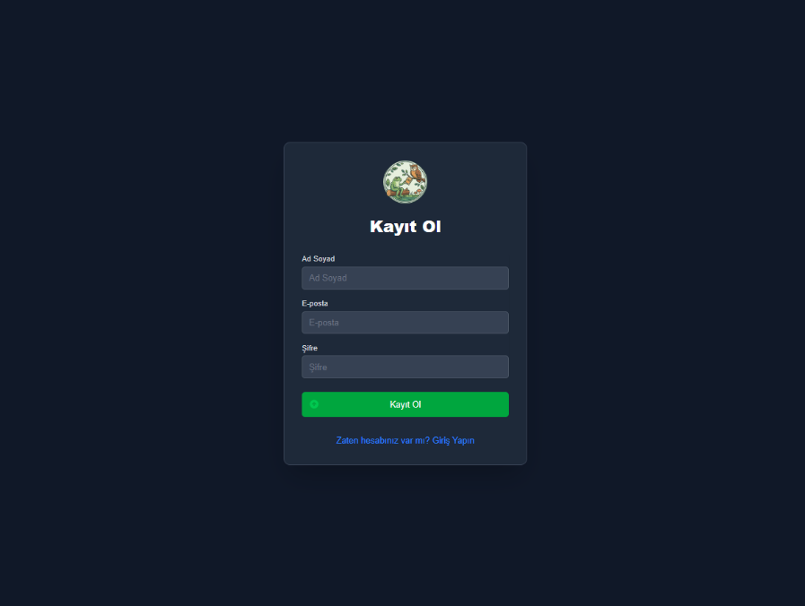
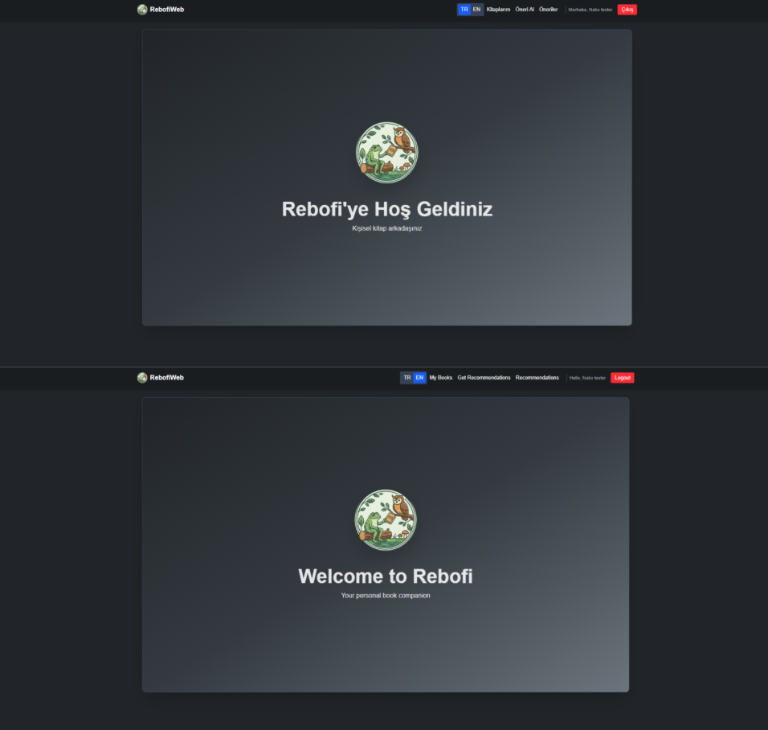
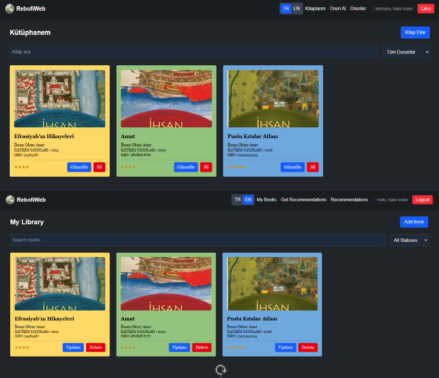
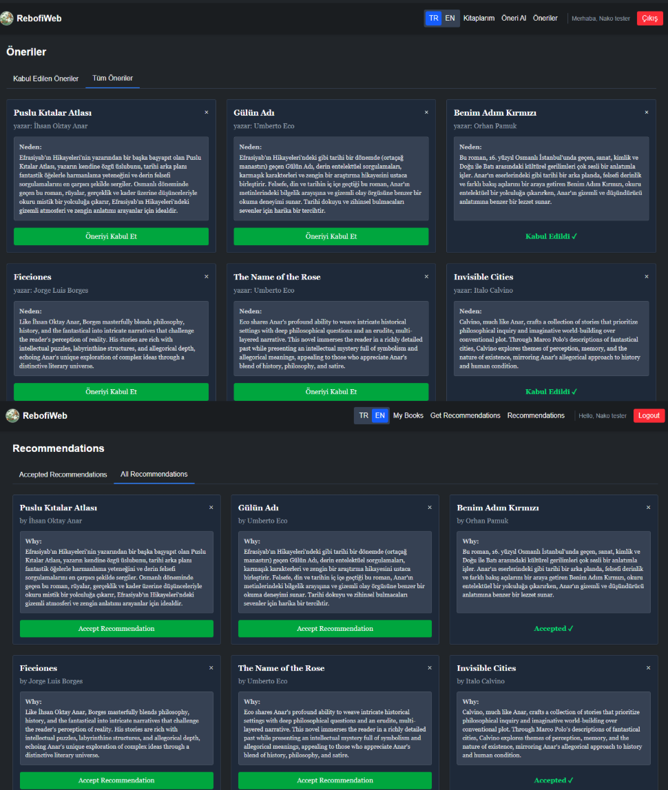
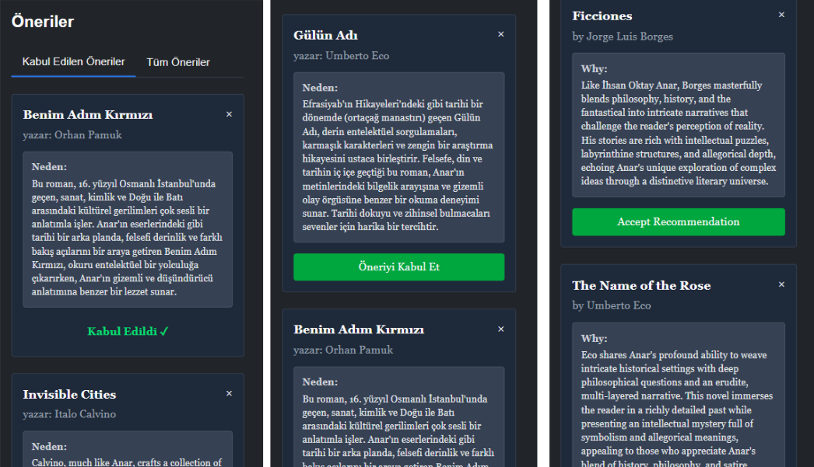

# 📚 RebofiWeb - AI Book Recommendation System

RebofiWeb, kullanıcıların kişisel kütüphanelerini yönetmelerine ve **Google Gemini AI** kullanarak yeni kitaplar keşfetmelerine yardımcı olan kişiselleştirilmiş bir kitap öneri uygulamasıdır.

## 🚀 Temel Özellikler
- **Yapay Zeka Önerileri:** Gemini AI ile kütüphanenizdeki kitaplara dayalı, açıklamalı öneriler.
- **Kütüphane Yönetimi (CRUD):** Kitap ekleme, silme, puanlama ve okuma durumu takibi.
- **Güvenli Kimlik Doğrulama:** JWT (JSON Web Token) tabanlı kullanıcı yönetimi.

## 🛠 Teknoloji Yığını
- **Frontend:** React 19, Vite 7, Tailwind CSS 4
- **Backend:** FastAPI (Python), Uvicorn
- **Veritabanı:** PostgreSQL, SQLAlchemy, Alembic
- **AI:** Google Generative AI (Gemini)
- **Altyapı:** Docker & Docker Compose

## 📸 Uygulama Ekran Görüntüleri

### 1. Giriş ve Kayıt Ekranları

---

### 2. Kütüphane Yönetimi

---

### 3. Yapay Zeka (Gemini) Önerileri

