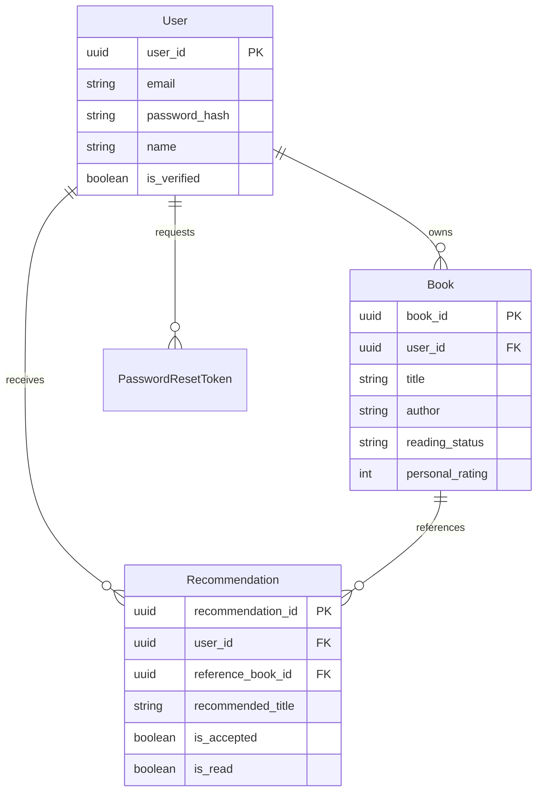

# Data Model: Personalized Book Recommender

## ER Diagram (Conceptual)

## Schema Definitions

### Users Table
| Column | Type | Constraints | Description |
|--------|------|-------------|-------------|
| `user_id` | UUID | PK, Default: gen_random_uuid() | Unique identifier |
| `email` | VARCHAR(255) | Unique, Not Null | User email address |
| `password_hash` | VARCHAR(255) | Not Null | Bcrypt hashed password |
| `name` | VARCHAR(255) | Not Null | Display name |
| `is_verified` | BOOLEAN | Default: False | Email verification status |
| `created_at` | TIMESTAMP | Default: Current Timestamp | Account creation date |
| `updated_at` | TIMESTAMP | Default: Current Timestamp | Last update date |

### Books Table
| Column | Type | Constraints | Description |
|--------|------|-------------|-------------|
| `book_id` | UUID | PK, Default: gen_random_uuid() | Unique identifier |
| `user_id` | UUID | FK -> Users.user_id, Not Null | Owner of the book |
| `title` | VARCHAR(500) | Not Null | Book title |
| `author` | VARCHAR(255) | Not Null | Author name |
| `publisher` | VARCHAR(255) | Nullable | Publisher name |
| `isbn` | VARCHAR(20) | Nullable | ISBN-10 or ISBN-13 |
| `publication_date` | DATE | Nullable | Release date |
| `print_number` | INTEGER | Nullable | Edition/Print number |
| `cover_image_url` | TEXT | Nullable | URL to stored cover image |
| `personal_rating` | INTEGER | Check 1-5 | User rating |
| `reading_status` | VARCHAR(20) | Check: completed, reading, want_to_read | Current status |
| `personal_notes` | TEXT | Nullable | User notes |
| `created_at` | TIMESTAMP | Default: Current | Record creation |
| `updated_at` | TIMESTAMP | Default: Current | Last update |

### Recommendations Table
| Column | Type | Constraints | Description |
|--------|------|-------------|-------------|
| `recommendation_id` | UUID | PK, Default: gen_random_uuid() | Unique identifier |
| `user_id` | UUID | FK -> Users.user_id, Not Null | User receiving rec |
| `reference_book_id` | UUID | FK -> Books.book_id, Nullable | Source book for rec |
| `recommended_title` | VARCHAR(500) | Not Null | Title of recommended book |
| `recommended_author` | VARCHAR(255) | Not Null | Author of recommended book |
| `recommendation_reason` | TEXT | Not Null | AI generated explanation |
| `is_accepted` | BOOLEAN | Default: False | If user accepted into list |
| `is_read` | BOOLEAN | Default: False | If user has read it |
| `recommended_at` | TIMESTAMP | Default: Current | Date generated |
| `accepted_at` | TIMESTAMP | Nullable | Date accepted |
| `read_at` | TIMESTAMP | Nullable | Date marked read |

### Password Reset Tokens
| Column | Type | Constraints | Description |
|--------|------|-------------|-------------|
| `token_id` | UUID | PK | Unique identifier |
| `user_id` | UUID | FK -> Users.user_id | User requesting reset |
| `token` | VARCHAR(255) | Unique, Not Null | Reset token string |
| `expires_at` | TIMESTAMP | Not Null | Expiration time |
| `used` | BOOLEAN | Default: False | If token was used |
